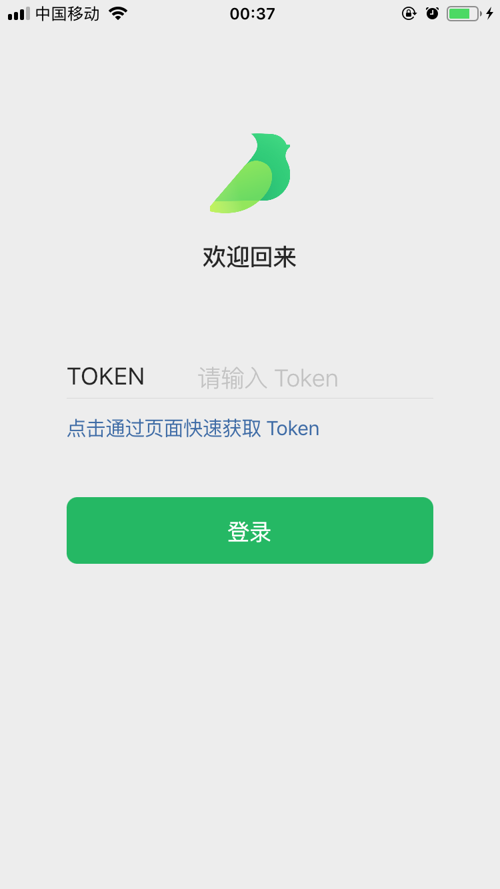
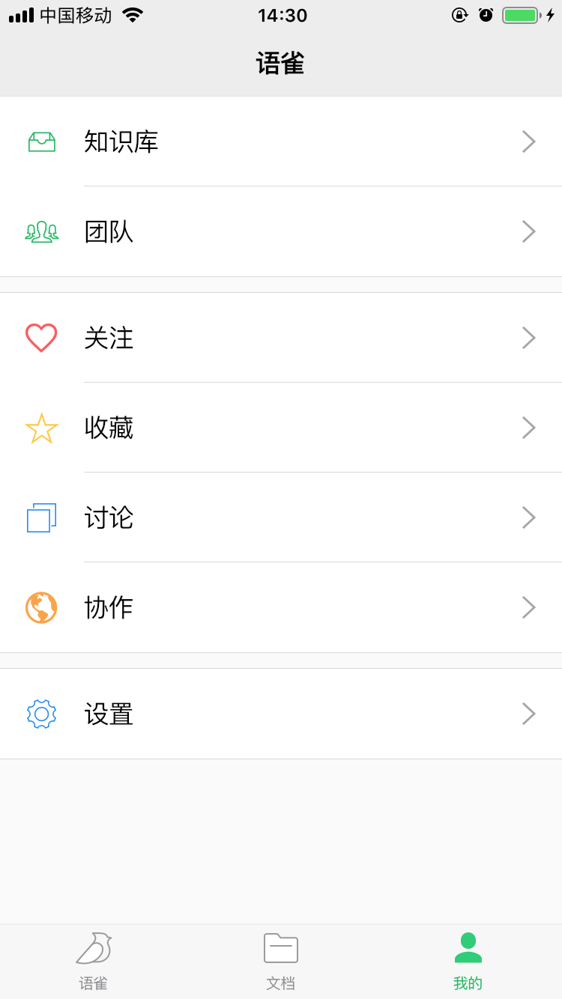
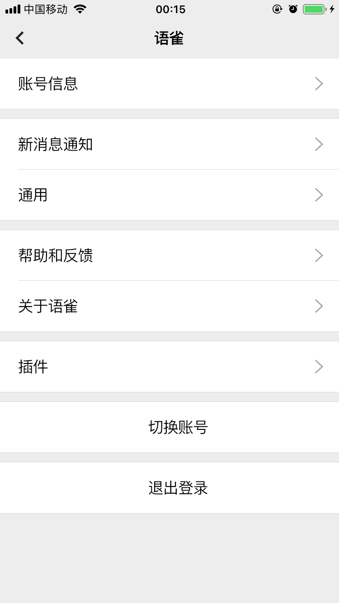

# 语雀

这个是非官方语雀客户端项目

## 开始

### 本地运行

> flutter run lib/boot/boot_local.dart

### 生成 pojo 序列化文件

> flutter packages pub run build_runner build --delete-conflicting-outputs

### 删除过期的证书

> cd ~/Library/MobileDevice/Provisioning\ Profiles

> rm *.mobileprovision